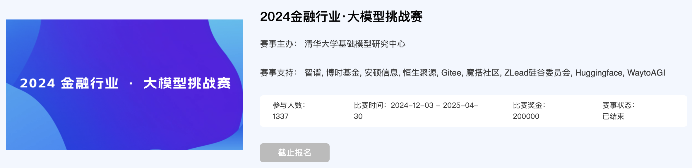

# 2026 具身仿真合成挑战赛｜从视频到可交互三维资产

> 让物体从一段视频中“走进”仿真环境：生成可渲染、可碰撞、可物理交互的 USD 资产。

[赛事主页](https://tianchi.aliyun.com/competition/entrance/532506/information) · [公开 Baseline 源码](https://github.com/ben1234560/AiLearning-Theory-Applying/tree/master/EmbodiedAI) · [官方资料与回放](https://github.com/ben1234560/AiLearning-Theory-Applying/tree/master/EmbodiedAI/%E7%AB%9E%E8%B5%9B%E5%AE%9E%E8%B7%B5/2026-%E5%85%B7%E8%BA%AB%E4%BB%BF%E7%9C%9F%E5%90%88%E6%88%90%E6%8C%91%E6%88%98%E8%B5%9B/public_asset_baseline/REFERENCES.md)

## 这是一场什么比赛？

具身智能不止要“看懂”世界，也要能在物理世界中行动。本赛题聚焦从多视角视频生成面向仿真的三维资产：几何、纹理、碰撞体、刚体与 USD 提交格式缺一不可。

这正好位于视觉理解、三维重建、生成式 AI、物理仿真和机器人学习的交叉点。无论你来自计算机视觉、图形学、机器人、强化学习，还是大模型方向，都可以在这里找到可落地的问题。

## 参与与使用说明

- 请以[官方赛事页面](https://tianchi.aliyun.com/competition/entrance/532506/information)的最新规则、时间安排和数据使用要求为准。

欢迎关注、交流和共建：把可复现的工程基线变成更可靠、更强的具身智能能力。Enjoy！
